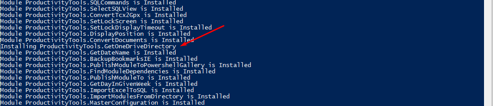

<!--Category:PowerShell--> 
 <p align="right">
    <a href="https://www.powershellgallery.com/packages/ProductivityTools.InstallModuleIfMissing/"></a>
    <a href="http://productivitytools.tech/install-module-if-missing/"><a> 
    <a href="https://github.com/pwujczyk/ProductivityTools.InstallModuleIfMissing/"></a>
</p>
<p align="center">
    <a href="http://http://productivitytools.tech/">
        
    </a>
</p>

# Install module if missing

Checks if the given module is already installed - if not – install it (performs Install-Module command).

<!--more-->

The module can be used in the PowerShell profile to set up the environment.

To make it fully usable before using it in the profile manual check of this module's existence should be performed.


````PowerShell
$installModuleIfMissing=Get-Module -ListAvailable -Name ProductivityTools.InstallModuleIfMissing
if ($installModuleIfMissing -eq $null)
{
    Write-Host "Installing ProductivityTools.InstallModuleIfMissing"
    Install-Module "ProductivityTools.InstallModuleIfMissing" -Force
}
else
{
    Write-Host "`ProductivityTools.InstallModuleIfMissing installed"
}
````

Instead of using this module, you could use ```Install-Module``` all the time, but this work much slower.


The example below shows that a lot of modules already are installed on the computer. One of it **ProductivityTools.GetOneDriveDirectory** is not installed and this module installs it. 

```PowerShell
Install-ModuleIfMissing ProductivityTools.SQLCommands
Install-ModuleIfMissing ProductivityTools.SelectSQLView
Install-ModuleIfMissing ProductivityTools.ConvertTcx2Gpx 
Install-ModuleIfMissing ProductivityTools.SetLockScreen
Install-ModuleIfMissing ProductivityTools.SetLockDisplayTimeout
Install-ModuleIfMissing ProductivityTools.DisplayPosition
Install-ModuleIfMissing ProductivityTools.ConvertDocuments
Install-ModuleIfMissing ProductivityTools.GetOneDriveDirectory 
Install-ModuleIfMissing ProductivityTools.GetDateName 
Install-ModuleIfMissing ProductivityTools.BackupBookmarksIE
Install-ModuleIfMissing ProductivityTools.PublishModuleToPowershellGallery
Install-ModuleIfMissing ProductivityTools.FindModuleDependencies
Install-ModuleIfMissing ProductivityTools.PublishModuleTo
Install-ModuleIfMissing ProductivityTools.GetDayInGivenWeek
Install-ModuleIfMissing ProductivityTools.ImportExcelToSQL
Install-ModuleIfMissing ProductivityTools.ImportModulesFromDirectory  
Install-ModuleIfMissing ProductivityTools.MasterConfiguration
```

Result of the above command.
<!--og-image-->
